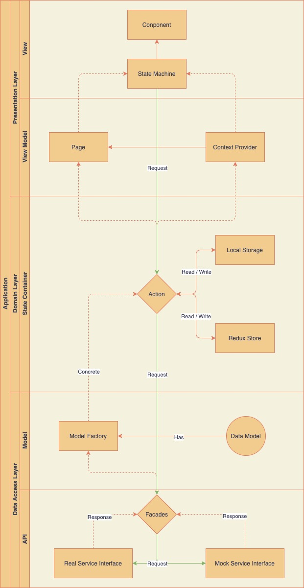

# Banking App Example

## Requirement

_You’ll need to have Node >= 10 on your local development machine_ (but it’s not required on the server).

You can use _nvm_ (macOS/Linux) or _nvm-windows_ to switch Node versions between different projects.

## Remote

- origin https://github.com/lexionlu-design/bankee-app.git

- release https://git-codecommit.ap-northeast-1.amazonaws.com/v1/repos/Main_WebView

## Todo List

- [ ] Overview

  - [ ] Type System
  - [ ] Model

- [ ] Component ( React )

  - [ ] Style ( Tailwindcss )
  - [ ] UI Behavior ( Event, xState )
  - [ ] Animation

- [ ] Domain Logic

  - [ ] Routing
  - [ ] State Management

- [ ] API Integration
  - [ ] Mock Data

## Architecture

## Setup

### `npm install -g yarn`

Make sure you have already installed `yarn` in your environment.
See [Installation](https://yarnpkg.com/getting-started/install).

### `yarn`

Installing all the dependencies

## Available Scripts

In the project directory, you can run:

### `yarn start`

Runs the app in the development mode.\
Open [http://localhost:3000](http://localhost:3000) to view it in the browser.

The page will reload if you make edits.\
You will also see any lint errors in the console.

### `yarn test`

Launches the test runner in the interactive watch mode.\
See the section about [running tests](https://facebook.github.io/create-react-app/docs/running-tests) for more information.

### `yarn build`

Builds the app for production to the `build` folder.\
It correctly bundles React in production mode and optimizes the build for the best performance.

The build is minified and the filenames include the hashes.\
Your app is ready to be deployed!

See the section about [deployment](https://facebook.github.io/create-react-app/docs/deployment) for more information.

## Learn More

You can learn more in the [Create React App documentation](https://facebook.github.io/create-react-app/docs/getting-started).

To learn React, check out the [React documentation](https://reactjs.org/).
To learn Tailwindcss, check out the [Tailwindcss documentation](https://tailwindcss.com/).
